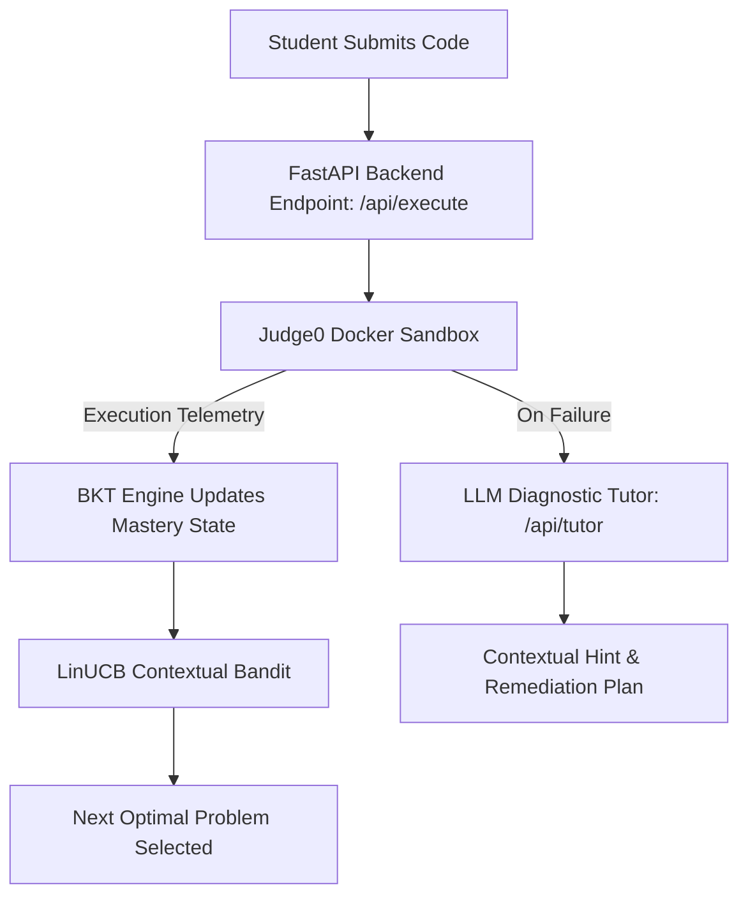

<div align="center">

# AdaptCode

**AI-powered adaptive programming practice platform that personalizes problem difficulty using Bayesian Knowledge Tracing, LinUCB contextual bandits, and LLM tutoring.**

[](LICENSE)
[](https://fastapi.tiangolo.com)
[](https://nextjs.org)
[](https://supabase.com)
[](https://judge0.com)

[Report Bug](https://github.com/Justinvcj/Adapt_Code/issues) * [Request Feature](https://github.com/Justinvcj/Adapt_Code/issues)

</div>

---

```
+-----------------------------------------------------------------------------+
|                    AdaptCode Adaptive Learning Loop                         |
|                                                                             |
|  +-----------------------+  +-----------------------+                       |
|  | Monaco Code Editor    |  | Multi-Language Code   |                       |
|  | (Python/Java/C++)     |  | Submission Payload    |                       |
|  +----------+------------+  +----------+------------+                       |
|             |                          |                                    |
|             +--------------------------+------------------------+           |
|                                        v                        v           |
|  +-----------------------------------------------------------------------+  |
|  |         Isolated Judge0 Sandbox: Secure Container Execution           |  |
|  +-------------------------------------+---------------------------------+  |
|                                        v                                    |
|  +-----------------------------------------------------------------------+  |
|  | Bayesian Knowledge Tracing (BKT) ---> LinUCB Contextual Bandit Selector|  |
|  +-------------------------------------+---------------------------------+  |
|                                        v                                    |
|  +-----------------------------------------------------------------------+  |
|  |    LLM Diagnostic Tutoring Hint <--- Next Optimal Challenge (ZPD)     |  |
|  +-----------------------------------------------------------------------+  |
+-----------------------------------------------------------------------------+
```

> Standard coding practice platforms rely on static difficulty tags and rigid problem sets, leaving students either stuck on difficult concepts or bored with repetitive questions.
> AdaptCode models each learner's mastery in real-time across a prerequisite graph of 12 algorithmic concepts, applying Bayesian Knowledge Tracing (P(L0), P(T), P(G), P(S)) and LinUCB contextual multi-armed bandits to serve challenges in the Zone of Proximal Development while providing instant LLM diagnostic feedback on failed test cases.

---

## Features

- **Dynamic Knowledge Tracing** -- Models concept mastery across 12 algorithmic topics in real time using Bayesian Knowledge Tracing (BKT).
- **Contextual Bandit Selection** -- Recommends optimal practice problems dynamically via LinUCB multi-armed bandit algorithms with ridge regression.
- **Isolated Code Sandbox** -- Executes and evaluates multi-language submissions securely inside Dockerized Judge0 containers.
- **Monaco In-Browser IDE** -- Delivers a complete in-browser coding environment with syntax highlighting, custom themes, and instant execution telemetry.
- **AI Diagnostic Tutoring** -- Generates targeted explanations and remediation hints automatically upon test case failures using LLM integration.
- **Curriculum Prerequisite Graph** -- Visualizes concept progression and dependencies across data structures and algorithms.

---

## How It Works



---

## Quick Start

### Prerequisites

| Requirement | Version | Notes |
|---|---|---|
| [Node.js](https://nodejs.org/) | 18+ | Frontend runtime |
| [Python](https://www.python.org/) | 3.10+ | Backend runtime |
| [Docker](https://www.docker.com/) | 20+ | Required for Judge0 sandbox container |
| [Supabase](https://supabase.com/) | Cloud / Local | PostgreSQL database and authentication |

### Installation

1. Clone the repository:
   ```bash
   git clone https://github.com/Justinvcj/Adapt_Code.git
   cd Adapt_Code
   ```

2. Set up the backend:
   ```bash
   cd backend
   pip install -r requirements.txt
   cp .env.example .env
   ```

3. Set up the frontend:
   ```bash
   cd ../frontend
   npm install
   cp .env.example .env.local
   ```

4. Launch services via Docker Compose:
   ```bash
   docker compose up -d
   ```

### Usage

Open `http://localhost:3000` in your browser, select a topic from the curriculum graph, and begin solving adaptive challenges with real-time feedback.

---

## Configuration

### Backend (`backend/.env`)

| Variable | Required | Default | Description |
|---|---|---|---|
| `SUPABASE_URL` | Yes | -- | Supabase project URL |
| `SUPABASE_KEY` | Yes | -- | Supabase service role or anon API key |
| `ZHIPU_API_KEY` | Yes | -- | API key for LLM tutoring explanations |
| `JUDGE0_URL` | No | `http://localhost:2358` | Endpoint for Judge0 execution sandbox |
| `FRONTEND_URL` | No | `http://localhost:3000` | Allowed CORS origin |

### Frontend (`frontend/.env.local`)

| Variable | Required | Default | Description |
|---|---|---|---|
| `NEXT_PUBLIC_API_URL` | No | `http://localhost:8000` | FastAPI backend URL |

---

## Tech Stack

| Layer | Technology |
|---|---|
| Frontend | Next.js 14, React 18, TypeScript, Tailwind CSS, Monaco Editor, Framer Motion, Lucide React |
| Backend | FastAPI, Uvicorn, Pydantic, Supabase Python SDK, NumPy, SlowAPI |
| Execution Sandbox | Judge0, Docker, Docker Compose |
| AI & Adaptive Engine | ZhipuAI / OpenAI LLM, Bayesian Knowledge Tracing (BKT), LinUCB Bandit |
| Testing | Pytest, Jest |

---

## Testing

```bash
# Run backend test suite
cd backend && pytest

# Run frontend unit tests
cd ../frontend && npm test
```

---

## Contributing

Contributions are welcome. Please open an issue first to discuss the changes you would like to make.

1. Fork the Project
2. Create your Feature Branch (`git checkout -b feat/AmazingFeature`)
3. Commit your Changes (`git commit -m 'feat: add amazing feature'`)
4. Push to the Branch (`git push origin feat/AmazingFeature`)
5. Open a Pull Request

---

## License

Distributed under the MIT License. See [LICENSE](LICENSE) for details.